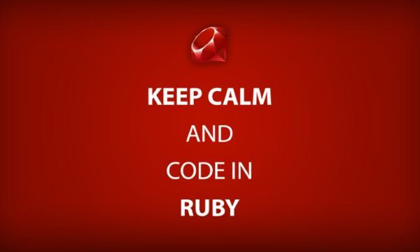
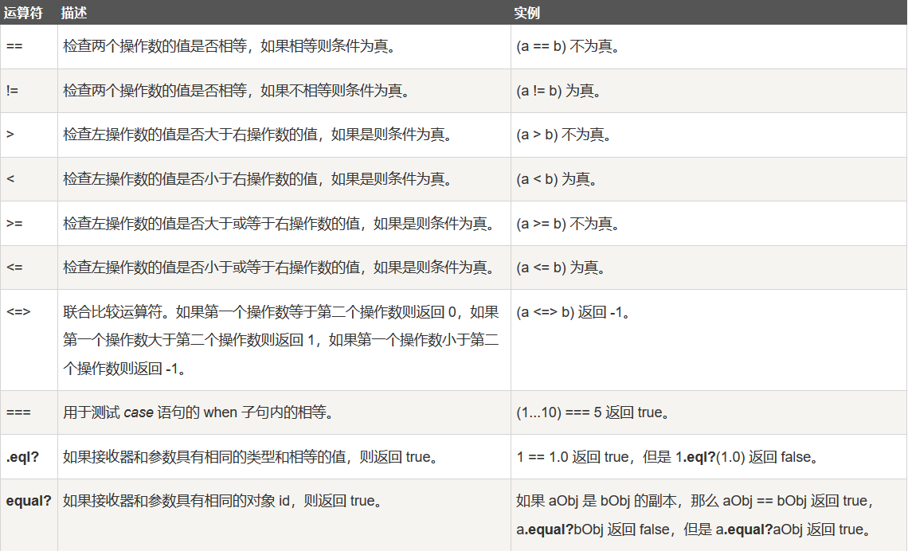
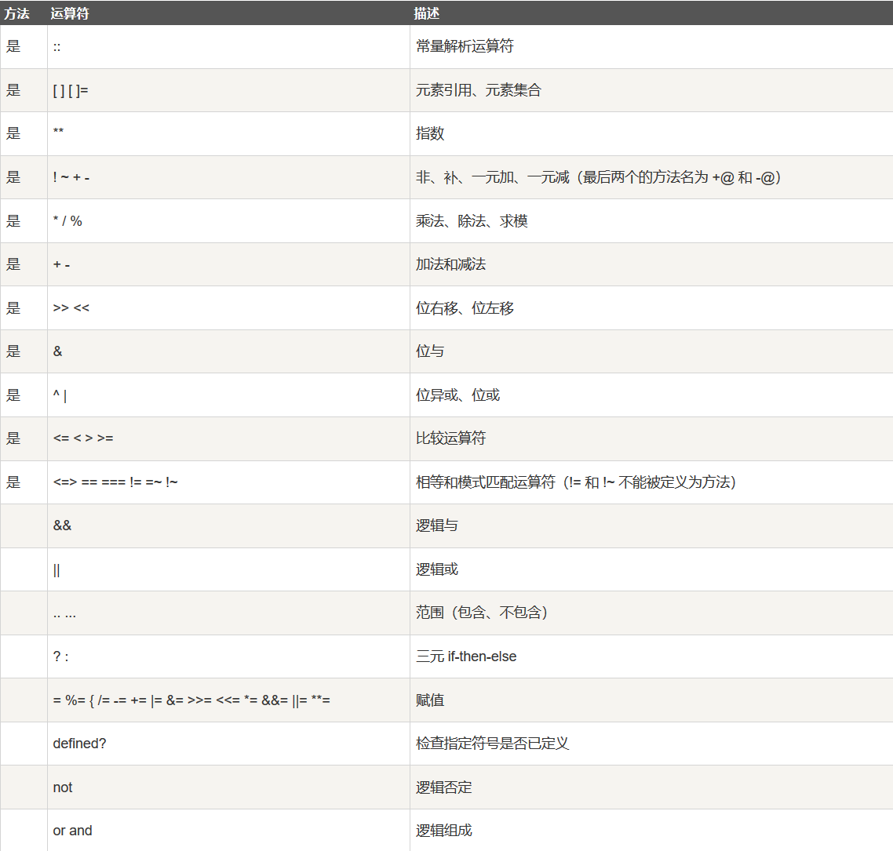

# Ruby学习记录




## Ruby安装
- [RubyInstaller](http://xiazai.zol.com.cn/detail/48/479399.shtml)
- IDEA开发还需要Ruby插件

```text
ruby -v
ruby 2.3.3p222 (2016-11-21 revision 56859) [x64-mingw32]
```

## 札记
1.使用语句`# -*- coding: UTF-8 -*-`来告诉解释器使用UTF-8编码来解析源码。

2.Ruby关键词：
- BEGIN
- do
- next
- then
- END
- else
- nil
- true
- alias
- elsif
- not
- undef
- and
- end
- or
- unless
- begin
- ensure
- redo
- until
- break
- false
- rescue
- when
- case
- for
- retry
- while
- class
- if
- return
- while
- def
- in
- self
- \_\_FILE\_\_
- defined?
- module
- super
- \_\_LINE\_\_

3.算术运算符有`**`的支持，且指数可以是浮点数。

4.Ruby提供了四种类型的变量：
- 局部变量：局部变量是在方法中定义的变量，在方法外是不可用的，以小写字母或`_`开始。
- 实例变量：实例变量可以跨任何特定的实例或对象中的方法使用。这意味着，实例变量可以从对象到对象的改变。实例变量在变量名之前放置符号(`@`)。
- 类变量：类变量可以跨不同的对象使用。类变量属于类，且是类的一个属性。类变量在变量名之前放置符号(`@@`)。
- 全局变量：类变量不能跨类使用。如果您想要有一个可以跨类使用的变量，您需要定义全局变量。全局变量总是以美元符号(`$`)开始。

5.5种特殊伪变量：有着局部变量的外观，行为却像常量，即不能给这些变量赋任何值。
- self: 当前方法的接收器对象
- true: 代表 true 的值
- false: 代表 false 的值
- nil: 代表 undefined 的值
- \_\_FILE\_\_: 当前源文件的名称
- \_\_LINE\_\_: 当前行在源文件中的编号

6.比较运算符：<br/>


7.Ruby运算符优先级：<br/>


8.在Ruby中，类和方法也可以被当作常量。

9.Ruby块的概念：
- 块由大量的代码组成
- 需要给块取个名称
- 块中的代码总是包含在大括号{}内
- 块总是从与其具有相同名称的函数调用
- 可以使用yield语句来调用块

10.Ruby支持模块：
- 模块提供了一个命名空间和避免名字冲突
- 模块不能实例化
- 模块没有子类
- 模块只能被另一个模块定义
